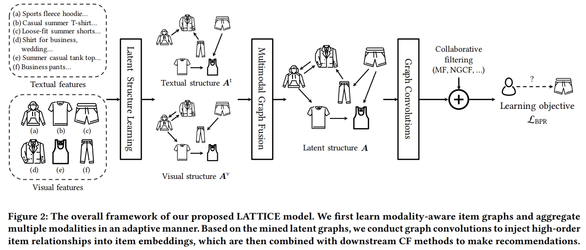

# LATTICE



This is the code for the ACM Multimedia 2021 Paper: [Mining Latent Structures for Multimedia Recommendation](https://dl.acm.org/doi/10.1145/3474085.3475259).

## Usage

### Dataset Preparation

- Download **5-core reviews data**, **meta data**, and **image features** from [Amazon product dataset](http://jmcauley.ucsd.edu/data/amazon/links.html). Put data into the directory `data/meta-data/`.

- Install [sentence-transformers](https://www.sbert.net/docs/installation.html) and download [pretrained models](https://www.sbert.net/docs/pretrained_models.html) to extract textual features. Unzip pretrained model into the directory `sentence-transformers/`:

  ```
  ├─ data/: 
      ├── sports/
      	├── meta-data/
      		├── image_features_Sports_and_Outdoors.b
      		├── meta-Sports_and_Outdoors.json.gz
      		├── reviews_Sports_and_Outdoors_5.json.gz
      ├── sentence-transformers/
          	├── stsb-roberta-large
  ```

- Run `python build_data.py` to preprocess data.

- Run `python cold_start.py` to build cold-start data.

- We provide processed data [Baidu Yun](https://pan.baidu.com/s/1SWe-XE23Nn0i4xSOXV_JyQ) (access code: m37q), [Google Drive](https://drive.google.com/drive/folders/1sFg9W2wCexWahjqtN6MVc4f4dMj5hyFp?usp=sharing).

### Quick Start

Start training and inference as:

```
cd codes
python main.py --dataset {DATASET}
```

For cold-start settings:
```
python main.py --dataset {DATASET} --core 0 --verbose 1 --lr 1e-5
```

## Requirements

- Python 3.6
- torch==1.5.0
- scikit-learn==0.24.2

## Citation

Please cite our paper if you use the code:

```
@inproceedings{LATTICE21,
  title     = {Mining Latent Structures for Multimedia Recommendation},
  author    = {Zhang, Jinghao and 
               Zhu, Yanqiao and 
               Liu, Qiang and
               Wu, Shu and 
               Wang, Shuhui and 
               Wang, Liang},
  booktitle = {Proceedings of the 29th ACM International Conference on Multimedia},
  pages     = {3872–3880},
  year      = {2021}
}
```

## Acknowledgement

The structure of this code is largely based on [LightGCN](https://github.com/gusye1234/LightGCN-PyTorch). Thank for their work.

